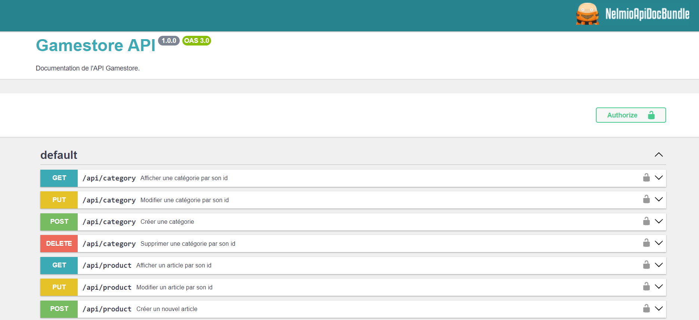

# Gamestore
Ce site est un site vitrine pour la boutique de jeux vidéo : Gamestore

[![Author]](https://github.com/luciletrc)

## Documentation

Before the development, **be sure to be comfortable with your current work environment**.
Like to setup your IDE, install all necessary plugins, prepare your keyboard shortcuts, create your Bash aliases etc...

- [Awesome dotfiles](https://github.com/webpro/awesome-dotfiles)
- [Lean and mean dev with PHPStorm](https://symfonycasts.com/screencast/phpstorm)

As soon as everything is ready, you can read some docs during the development.
Take a look below !

- [Tools helping developers every day](https://www.youtube.com/watch?v=_OEDoPMvNY4)
- [Symfony Fast Track](https://symfony.com/doc/6.2/the-fast-track/fr/index.html)

## Installation

### Project requirements

- [PHP >=7.2.5 or higher](http://php.net/manual/fr/install.php)
- [SQL >=8.0](https://www.mysql.com/fr/downloads/)
- [Symfony CLI](https://symfony.com/download)
- [Composer](https://getcomposer.org/download)
- [Git](https://git-scm.com/book/en/v2/Getting-Started-Installing-Git)
- PHP extensions such as : Iconv, JSON, PCRE, Session, Tokenizer and the [usual Symfony application requirements][1].

```bash
$ symfony check:requirements # To check minimal requirements for the project
```

### View



1 . **Register a GPG/SSH Key into your Gitlab/Github account** to push verified commits and registry images.

2 . Clone the current repository (SSH):
```bash
$ git clone 'git@github.com:Luciletrc/GamestoreBack.git'
```

3 . Move in and create few `.env.{environment}.local` files, according to your environments with your default configuration.
**.local files are not committed to the shared repository.**

```bash
$ cp .env .env.local   # Create .env.$APP_ENV.local files. Complete them with your configuration.
```

> `.env` equals to the last `.env.dist` file before [november 2018][2].

4 . Set your DATABASE_URL in `.env.{environment}.local` files and run these commands :

```bash
$ composer install        # Install all PHP packages
$ php bin/console d:d:c   # Create your DATABASE related to your .env.local configuration
$ php bin/console d:m:m   # Run migrations to setup your DATABASE according to your entities
```

## Usage

```bash
$ symfony server:start    # Use this command to start a local server.
```

To see all available routes, services... :

```bash
$ bin/console debug:router
$ bin/console debug:container
$ bin/console debug:...
```

[⬆️ Back to top]